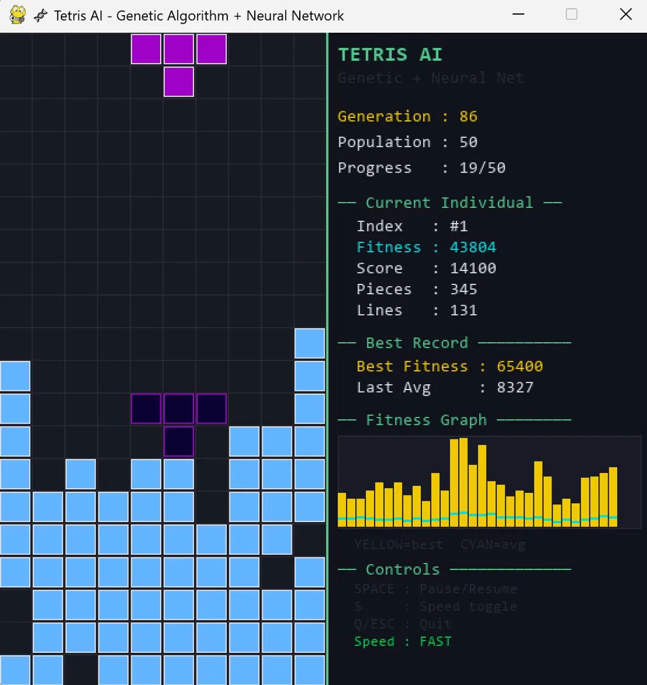

# 🧬 Tetris AI - 유전 알고리즘 + 인공신경망

유전 알고리즘(GA)과 인공신경망(ANN)을 활용하여 테트리스를 스스로 학습하는 AI 프로젝트입니다.  
Mario DeepLearning 프로젝트에서 영감을 받아 동일한 GA 구조를 테트리스에 적용했습니다.

---

## 📊 학습 결과

| 항목 | 결과 |
|------|------|
| 최고 Fitness | **65,400** |
| 최고 Lines | 131줄 |
| 최고 Pieces | 345개 |
| Best 달성 세대 | 39세대 |
| 총 학습 세대 | 86세대+ |

> 39세대에서 처음으로 65,400 달성 후 안정적으로 40,000~65,000 유지



---

## 📁 파일 구조

```
tetris_ga/
├── main.py              # 메인 실행 + Pygame 시각화
├── genetic_algorithm.py # 유전 알고리즘 (선택/교배/변이)
├── neural_network.py    # 인공신경망 (염색체)
├── tetris_env.py        # 테트리스 게임 환경
└── requirements.txt
```

---

## 🧠 신경망 구조

```
입력층 (15개)             은닉층 (32개)      출력층 (1개)
 총높이                    ReLU              action 점수
 줄제거수                  Hidden
 구멍 수           →→→    Layer      →→→   (가장 높은
 울퉁불퉁함                                  점수의 action 선택)
 최대높이
 열별높이 × 10개
```

---

## 🔬 유전 알고리즘 구성

| 요소 | 방법 | 설정값 |
|------|------|--------|
| 선택 | 엘리트 보존 | 상위 5개 보존 |
| 선택 | 룰렛 휠 | 나머지 45개 |
| 교배 | SBX (Simulated Binary Crossover) | eta=100 |
| 변이 | 가우시안 돌연변이 | 확률 8% |
| 개체 수 | - | 50개 |
| 게임당 최대 피스 | - | 1000개 |

---

## 🎮 AI 동작 방식

매 턴, AI는 **가능한 모든 배치 위치**를 탐색하여 신경망으로 점수를 계산하고 가장 좋은 위치에 블록을 배치합니다.

```
Fitness = 테트리스 점수 + 배치 피스 수 × 2 + 줄 제거 수 × 50
```

---

## 🚀 실행 방법

```bash
# Python 3.11 권장 (3.14는 pygame 미지원)
pip install -r requirements.txt
python main.py
```

## ⌨️ 조작 키

| 키 | 기능 |
|----|------|
| SPACE | 일시정지 / 재개 |
| S | 속도 전환 (SLOW / NORMAL / FAST) |
| Q / ESC | 종료 |

---

## 📈 학습 과정 분석

- **0~10세대**: 무작위에서 기본 생존 전략 학습
- **10~38세대**: 30,000~35,000 구간에서 정체 (로컬 옵티마)
- **39세대**: 🚀 65,400 돌파 (계단식 성장)
- **40세대~**: 40,000~65,000 사이에서 등락 반복

마리오 프로젝트와 동일하게 **계단식 성장** 패턴이 관찰됨.

---

## 🔧 버전별 개선 이력

| 버전 | 변경사항 | Best Fitness |
|------|---------|-------------|
| v1.0 | 입력 5개, 은닉 16, 돌연변이 5% | 36,600 (정체) |
| v2.0 | 입력 15개, 은닉 32, 돌연변이 8% | **65,400** ✅ |

---

## 🔮 향후 개선 방향

- [ ] 은닉층 추가 (2층 구조)
- [ ] 적응형 돌연변이율
- [ ] 가중치 저장/불러오기 기능
